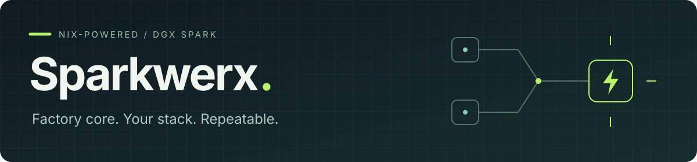

<p align="center">
  <a href="docs/getting-started.md">Get started</a> ·
  <a href="docs/configuration.md">Configure</a> ·
  <a href="docs/operations.md">Operate</a> ·
  <a href="docs/status.md">What's ready</a> ·
  <a href="docs/agent-guide.md">For AI agents</a>
</p>

[](https://github.com/armenr/sparkwerx/actions/workflows/ci.yml)

Sparkwerx turns a factory NVIDIA DGX Spark into a repeatable development and AI
machine—without replacing DGX OS with NixOS or taking over NVIDIA's GPU stack.

The idea is simple: **get a Spark, clone the repo, declare its role, and make
the configuration repeatable.** Nix handles packages and configuration;
Home Manager handles the user environment; System Manager handles specific
host services. CUDA-heavy workloads can use pinned containers or source builds
where those fit the vendor-supported path.

## Why this exists

One carefully configured machine is useful. Being able to recreate it—and
bring up the next three without rediscovering every decision—is better.

- **Keep the factory core.** NVIDIA retains the OS, driver, CUDA, Docker,
  Container Toolkit, and Dashboard packages.
- **Know what you're installing.** Explicit package selections, exact pins,
  and a practical [software manifest](docs/software-manifest.md).
- **Make access a choice.** Optional Nix-managed Tailscale, with node identity
  and account state kept outside Git and the Nix store.
- **Keep headless genuinely useful.** Stop GDM and the Dashboard GUI while
  preserving remote access, compute services, and the installed factory desktop.
- **Keep personal tools personal.** Armen's overlay is separate from the
  three-tool fleet base.
- **Have a way back.** Test transitions in disposable environments, retain
  previous generations, and arm rollback before host changes.

## What's ready

| Capability | Today |
| --- | --- |
| Fresh-host setup | Resumable Nix → services → headless → Home installation |
| Fleet CLI base | `ncdu`, `lazydocker`, `devbox` |
| Armen's personal tools | Nix-managed Codex CLI |
| Tailscale + Tailscale SSH | Optional per host, managed by Nix |
| Headless host mode | Stops the desktop; keeps factory GNOME installed |
| General desktop switching | Not finished; current switch operator is pilot-specific |
| Ghostty and Hyprland | Packaged; desktop integration in progress |
| Chromium, Zed, LM Studio | Packaged; not installed by setup yet |
| KDE and AI/robotics workloads | Planned, not deployed |

See [status](docs/status.md) for details and the [roadmap](docs/roadmap.md)
for what's next.

## Get started

Use `DGX-setup` as the checkout name: existing recovery paths depend on it.

```bash
mkdir -p ~/Development
git clone https://github.com/armenr/sparkwerx.git ~/Development/DGX-setup
cd ~/Development/DGX-setup
```

Follow the [getting-started guide](docs/getting-started.md) to add your host to
[`fleet/hosts.json`](fleet/hosts.json) and commit its declaration.

Preview the changes:

```bash
./scripts/dgx-setup plan
```

Apply the configuration:

```bash
./scripts/dgx-setup converge
```

Run as the declared user, without `sudo`. Setup asks for elevated access when
needed and resumes with the same command after a disconnect. At
`AWAITING_REBOOT`, reboot and reconnect before the displayed rollback deadline.

Setup currently targets headless ARM64 Sparks with one user and the fixed
base package set. The [configuration guide](docs/configuration.md#current-limits)
explains the supported choices.

## Understand the pieces

| Piece | Job |
| --- | --- |
| [Factory DGX OS](docs/architecture.md#ownership) | Hardware support and NVIDIA-managed infrastructure |
| [Nix](root/nix/README.md) | Exact package versions, builds, and development environments |
| [Home Manager](docs/user-overlays.md) | User packages, launchers, and selected non-secret settings |
| [System Manager](root/system-manager/README.md) | Reviewed service and desktop-target configuration on Ubuntu |
| [Workload roles](.agents/skills/dgx-spark-ops/references/workload-map.md) | Future application runtimes, with explicit storage and exposure |
| [Git](docs/configuration.md) | Host choices, package pins, decisions, and sanitized evidence |

Nix does not make containers mandatory, and containers do not replace Nix.
See the [architecture guide](docs/architecture.md#nix-or-containers) for how we
choose between them.

## Useful commands

```bash
# Read-only host/configuration comparison
./scripts/dgx-setup plan

# Read-only user-profile status
./scripts/dgx-home status

# Read-only release/drift audit; --offline skips remote lookups
.agents/skills/dgx-spark-ops/scripts/audit-updates.sh --offline
```

See the [operations guide](docs/operations.md) for updates and recovery.

## For AI agents

Start with [AGENTS.md](AGENTS.md), then the
[agent guide](docs/agent-guide.md). The repository includes the
[`dgx-spark-ops` skill](.agents/skills/dgx-spark-ops/SKILL.md) and a
[copyable prompt library](.agents/skills/dgx-spark-ops/references/prompt-library.md).

A useful first request:

```text
$dgx-spark-ops Check this Sparkwerx checkout and host. Tell me what's
installed, what still needs work, and what you'd do next. Make no changes.
```

## Find your way around

[Documentation index](docs/README.md) ·
[Architecture](docs/architecture.md) ·
[Decisions](docs/decision-register.md) ·
[Software manifest](docs/software-manifest.md) ·
[Validation evidence](docs/2026-09-06-fresh-host-convergence-integration.md)

Want to contribute? See [development, CI, and releases](docs/development.md).
